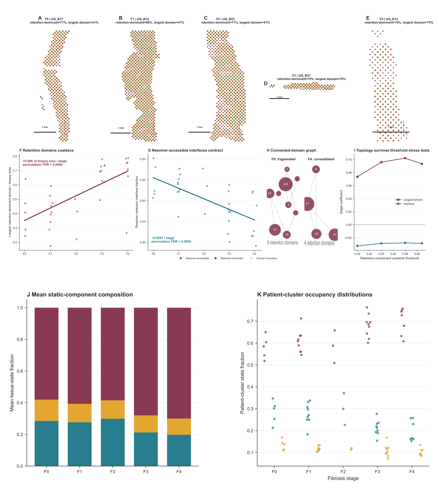

# PathoNiche liver-fibrosis spatial retention atlas

Source data, derived results, code snapshots, audit records, and revised figures for the manuscript **“Stellate-cell retention progressively occupies liver scar and constricts repair interfaces.”**

> Release status: `v2.1.0`, a validated reproducibility release with clean-environment reconstruction. The repository is <https://github.com/LightChainr/PathoNiche-ResolverWindow>; the version-specific archival DOI is <https://doi.org/10.5281/zenodo.22138229>.



## Findings supported by this release

1. HSC-retention coupling to the human scar field strengthens across fibrosis stages.
2. Retention-dominant regions enlarge and coalesce while interfaces with endothelial and macrophage repair programs contract.
3. Geometry-only reconstruction and six mapping stress tests preserve retention-domain expansion and repair-interface compression; both effects also survive every leave-one-array-out analysis.
4. Replicated mouse withdrawal data show incomplete return toward the untreated state.
5. A static two-component Gaussian-mixture model describes the human spatial distribution and has a stable equal-posterior boundary. The analysis does not estimate a physical potential, dynamical flow field, or hysteresis parameter.
6. An asymmetric, order-aware LINCS score nominates forward and reverse role assignments for a factorial experiment. It does not measure an observed treatment-order effect or clinical efficacy.
7. The evidence-coded mechanism circuit separates literature-established links, project-supported associations, and candidate edges that require direct perturbational testing.

The release includes aggregate results from an 8,142-patient index cohort and a 772-patient longitudinal elastography cohort. Participant-level institutional records are not distributed.

## Quick validation

```bash
python3 -m venv .venv
source .venv/bin/activate
python -m pip install -r environment/requirements.txt
python scripts/validate_release.py
```

To rebuild the four reviewer-facing replacement panels from included derived tables:

```bash
python code/reviewer_revision/rebuild_high_risk_panels.py
```

To rebuild the evidence-coded mechanism panel and the editable main SVG plates:

```bash
python code/figures/build_mechanism_circuit.py
python code/figures/rebuild_main_figure_plates.py
```

## Repository map

- `data/clinical_aggregate/`: non-identifying cohort counts, effect estimates, and validation metrics.
- `data/flow_aggregate/`: aggregate fatty-liver lymphocyte-panel summaries.
- `data/UQ_resolver_source_inputs/`: public UQ MASLD spatial module and coupling results.
- `data/UQ_spatial_derived/`: derived spatial, Gaussian-mixture, mouse, topology, and perturbational results.
- `data/UQ_spatial_mapping_derived/`: geometry-only Visium component assignments and summaries.
- `data/LINCS_derived/`: name-collapsed LINCS compound summaries.
- `data/mechanism_summary/`: edge-level mechanism evidence, phase tests, topology summaries, and order-score sensitivity.
- `data/mouse_pseudobulk_derived/`: public-data pseudobulk inputs and trajectory summaries.
- `data/figure_reconstruction/`: compact inputs for the corrected reviewer-facing panels.
- `code/public_mechanism/`: frozen public-data analysis scripts.
- `code/governed_clinical_transparency/`: institutional workflow snapshots; patient-level inputs are withheld.
- `code/reviewer_revision/`: self-contained high-risk-panel reconstruction.
- `code/figures/`: mechanism-circuit construction and editable main-figure composition.
- `figures/main/`: seven revised composite figures in PNG and PDF; Figures 1, 2, 5, and 7 also include editable SVG.
- `figures/source_panels/`: editable source panels used to compose Figure 7.
- `figures/reviewer_revision/`: editable SVG/PDF/PNG replacement panels and their source manifest.
- `figures/supplementary/`: Supplementary Figures S1-S30, including the geometry-only mapping sensitivity plate.
- `docs/methods_audit/`: data-structure, chronology, UQ reconstruction, drug-score, and panel-statistics audits.
- `docs/PANEL_PROVENANCE.tsv`: panel-level dataset, unit, sample size, method, script, output, and inference boundary.

## Analysis chronology

The final four-part analytical framework was written after several core analyses had been completed. It is therefore reported as a final organizational framework, not as prospective preregistration. The dated evidence is provided in `docs/methods_audit/machine_readable/Analysis_Timeline.tsv` and `Prespecification_and_Analysis_Timeline.docx`.

UQ biopsy geometry and registration were completed before the retained-HSC, repair, and ECM score outputs in the archived run. The archive does not document strict analyst blinding to all biological information. An independent coordinate-only component reconstruction and mapping sensitivity analysis are provided in `docs/methods_audit/UQ_BIOPSY_RECONSTRUCTION_PROVENANCE.md` and `results/S15_UQ_biopsy_mapping_sensitivity/`.

## Reproducibility levels

| Level | Contents | Publicly runnable |
|---|---|---|
| A | Release validation, file-integrity checks, and numerical-anchor audit | Yes |
| B | Reviewer-facing replacement panels from included derived inputs | Yes |
| C | Derived UQ, mouse, LINCS, and aggregate clinical result inspection | Yes |
| D | Full public molecular or spatial reconstruction | Yes, after obtaining raw public data listed in `docs/RAW_DATA_ACCESSIONS.md` |
| E | Patient-level clinical and flow analysis | No; institutional approval and governed source data are required |

## Statistical units

- Institutional analyses use the patient as the inferential unit.
- GSE295293 uses nine mice, three per group, with animal-level pseudobulk.
- GSE305331 contains seven condition libraries, each pooled from three mice; its 543,639 nuclei are technical observations and phase comparisons are descriptive.
- UQ Visium models aggregate 33 biopsy fragments to 32 patient clusters for stage-level inference; spatial blocks support within-section fitting.
- UQ CODEX contains one section at each displayed stage and is descriptive.
- LINCS signatures and compound pairs support computational ranking only.

## Data governance

Excluded material includes participant-level records, direct or hashed clinical identifiers, linkage keys, ethics documents, author contact files, credentials, raw public sequencing or imaging archives, LINCS Level 5 matrices, and model weights. See `docs/PRIVACY_AND_GOVERNANCE.md`.

## Licenses and citation

- Original analysis code: MIT License.
- Author-owned documentation, figures, and derived tabular outputs: CC BY 4.0.
- Third-party source datasets remain governed by their original terms.

Please cite version `v2.1.0` using <https://doi.org/10.5281/zenodo.22138229> and cite the associated manuscript. Machine-readable metadata are provided in `CITATION.cff`.
